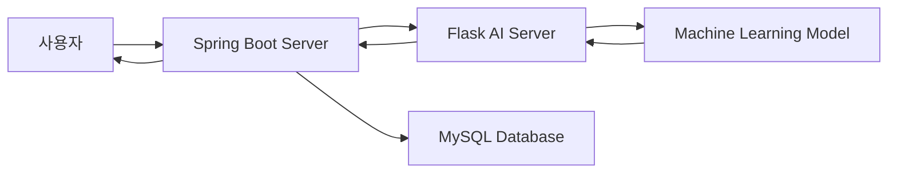
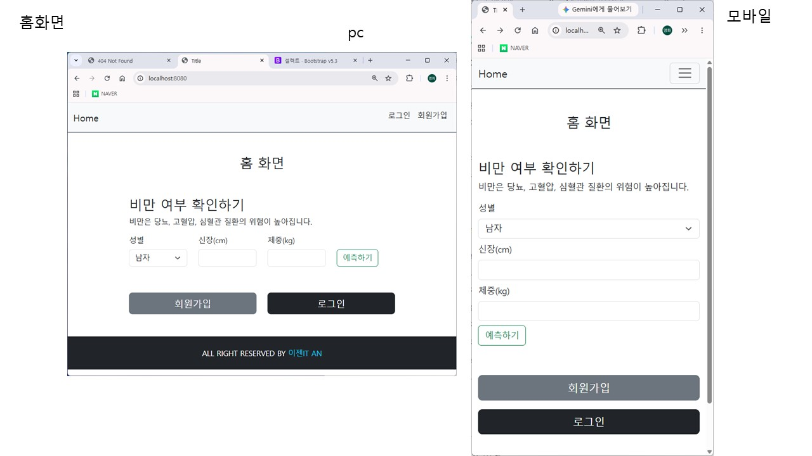
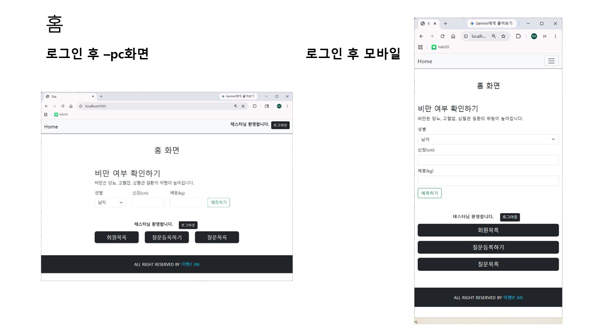
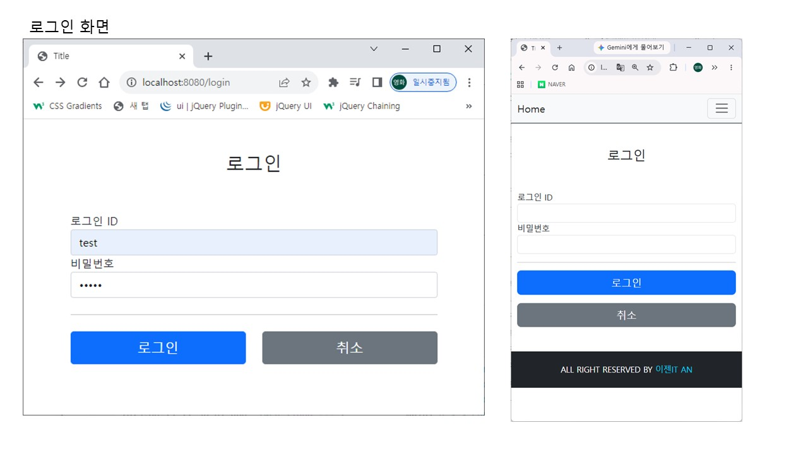
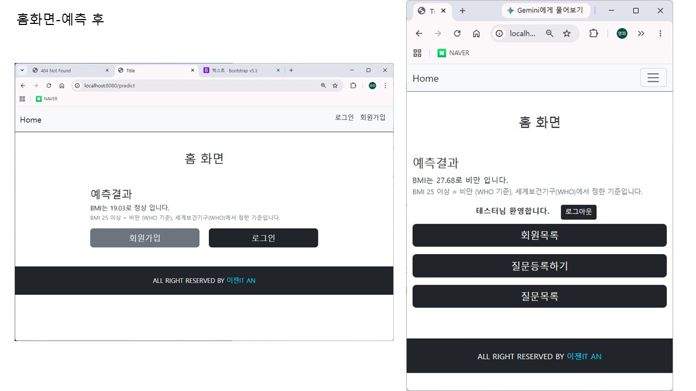
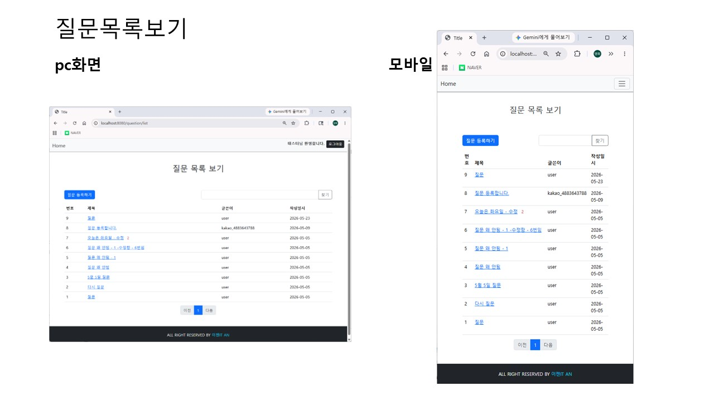
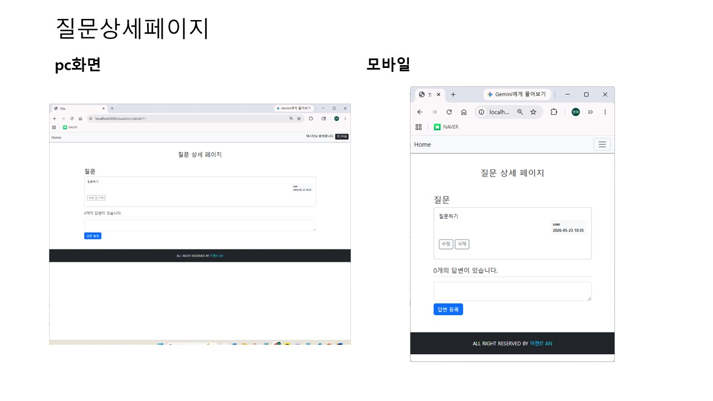
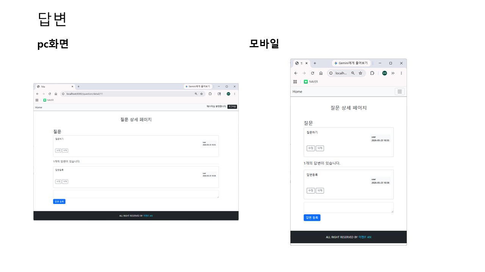
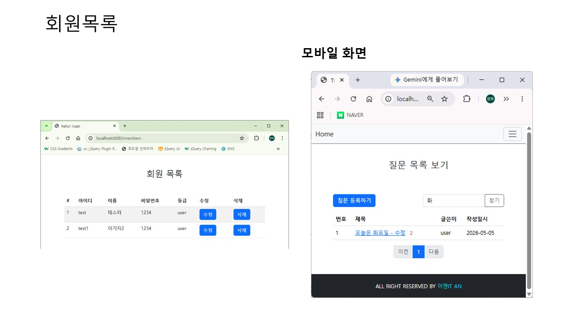
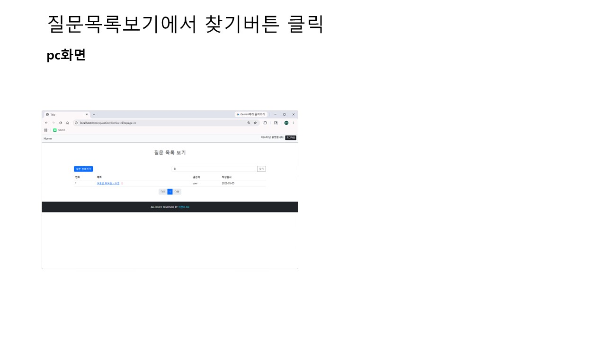

# 건강검진 데이터 기반 비만 예측 AI 웹 서비스

건강검진 데이터를 기반으로 사용자의 비만 여부를 예측하는 AI 웹 서비스입니다.

사용자는 키와 몸무게 데이터를 입력하여 비만 여부를 예측할 수 있으며, Spring Boot 서버가 Flask 기반 AI 서버와 연동하여 예측 결과를 제공합니다. 이 프로젝트는 Spring Boot와 Flask 서버를 분리한 AI 서비스 구조를 학습하고, REST API 통신 및 머신러닝 모델 활용 경험을 쌓기 위해 제작되었습니다.

## 주요 기능

- 회원가입 및 로그인
- Spring Security 기반 인증 처리
- 게시판 CRUD
- 키와 몸무게 데이터 입력
- Flask AI 서버 연동
- 비만 여부 예측
- 비회원 예측 기능 지원

## 사용자 흐름

1. 사용자는 메인 화면에서 키와 몸무게 데이터를 입력합니다.
2. Spring Boot 서버가 Flask AI 서버로 입력 데이터를 전달합니다.
3. Flask 서버는 머신러닝 모델을 통해 비만 여부를 예측합니다.
4. 예측 결과가 Spring Boot 서버로 반환됩니다.
5. 사용자는 웹 화면에서 예측 결과를 확인합니다.

## 기술 스택

| 구분 | 기술 |
| --- | --- |
| Backend | Spring Boot, Spring Security, JPA |
| Frontend | Thymeleaf, Bootstrap |
| AI Server | Flask |
| Machine Learning | Scikit-learn |
| Database | MySQL |
| Build Tool | Gradle |
| Version Control | GitHub |

## 시스템 구조

## 포트폴리오 강조 포인트

- Spring Boot와 Flask 서버를 분리하여 AI API 서버 구조를 구현했습니다.
- REST API 기반으로 Spring Boot 서버와 Flask 서버 간 통신을 구현했습니다.
- Spring Security를 이용한 로그인 인증 구조를 적용했습니다.
- 건강검진 공공데이터를 활용하여 머신러닝 예측 모델을 구축했습니다.
- 로그인하지 않은 사용자도 사용할 수 있는 AI 예측 기능을 구현했습니다.
- 실제 AI 서비스 구조를 고려하여 백엔드 서버와 AI 서버를 분리 설계했습니다.

## 문서

- [요구사항 정의서](docs/requirements.md)
- [개발 계획서](docs/development-plan.md)
- [백엔드 구현 계획](docs/backend-implementation-plan.md)
- [AI 서버 구현 계획](docs/ai-server-plan.md)
- [Spring Boot - Flask 서버 연동 구현 계획](docs/spring-flask-integration-plan.md)

## 화면캡쳐

### 메인 화면 - 로그인 전

### 메인 화면 - 로그인 후

### 로그인 페이지

### 예측 결과

### 게시글 목록

### 게시글 상세

### 답변 페이지

### 회원 목록

### 검색 페이지

